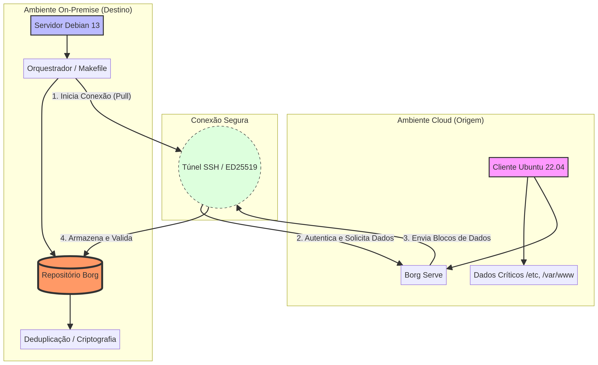

# 🛡️ Hybrid Backup Solution: Cloud & On-Premise Resiliency

[](https://aws.amazon.com/)
[](https://www.linuxfoundation.org/)
[](https://www.borgbackup.org/)
[](https://github.com/Garcez7R/aws-onprem-backup-borg)

## 📋 Sobre o Projeto

Este projeto apresenta uma implementação completa de **backup híbrido automatizado**, seguro e altamente eficiente. O objetivo é demonstrar como proteger dados críticos em ambientes de nuvem pública, transferindo-os para uma infraestrutura local (**On-Premise**) de forma resiliente.

A solução utiliza o **BorgBackup** para garantir que os dados sejam deduplicados, compactados e criptografados antes mesmo de saírem da origem, seguindo as melhores práticas de **soberania de dados** e **segurança cibernética**.

### Autor e Informações

| Detalhe | Informação |
| :-- | :-- |
| **Autor** | Rafael Garcez |
| **LinkedIn** | [linkedin.com/in/rgarcez7](https://linkedin.com/in/rgarcez7) |
| **Projeto** | Backup Híbrido Zero-Touch |
| **Foco Técnico** | Infraestrutura, Segurança e Automação |

## 🎯 Objetivos Técnicos

*   **Deduplicação na Fonte:** Redução drástica do tráfego de rede e uso de armazenamento.
*   **Arquitetura Pull:** Proteção contra ataques de ransomware no cliente em nuvem.
*   **Criptografia de Ponta a Ponta:** Garantia de confidencialidade com AES-256.
*   **Automação Zero-Touch:** Orquestração completa via Scripts e Makefile.
*   **Resiliência Híbrida:** Garantia de disponibilidade dos dados fora do provedor cloud.

## 🏗️ Arquitetura da Solução



O projeto baseia-se em um modelo de **Pull Backup**, onde o servidor local inicia a conexão segura e solicita os dados.

| Componente | Função | Tecnologia |
| :-- | :-- | :-- |
| **Cliente Cloud** | Origem dos dados críticos | Ubuntu 22.04 LTS |
| **Servidor Local** | Repositório seguro e orquestrador | Debian 13 |
| **Protocolo** | Transporte seguro de dados | SSH (ED25519) |
| **Motor de Backup** | Deduplicação e Criptografia | BorgBackup |

## 🚀 Navegação Rápida

*   **[Documentação Técnica](docs/):** Acesso a todos os guias detalhados.
*   **[Estudo de Caso](docs/ESTUDO_DE_CASO.md):** Análise aprofundada da solução.
*   **[Configuração Cloud](docs/CLOUD_SETUP.md):** Guia para o ambiente em nuvem.
*   **[Configuração Local](docs/LOCAL_SETUP.md):** Guia para o servidor local.
*   **[Notificações](docs/NOTIFICACOES.md):** Guia de alertas via Webhook.

## 📁 Estrutura do Repositório

```text
aws-onprem-backup-borg/
├── README.md               # Visão geral e guia rápido
├── Makefile                # Interface de automação do projeto
├── config/
│   └── backup.env.example  # Modelo de variáveis de ambiente
├── scripts/
│   ├── setup_vm.sh         # Configuração do Servidor Local
│   ├── setup_ec2.sh        # Configuração do Cliente Cloud
│   └── run_backup.sh       # Script orquestrador de backup
└── docs/
    ├── [ESTUDO_DE_CASO.md](docs/ESTUDO_DE_CASO.md)   # Análise teórica aprofundada
    ├── [CLOUD_SETUP.md](docs/CLOUD_SETUP.md)         # Guia de preparação do cliente
    ├── [LOCAL_SETUP.md](docs/LOCAL_SETUP.md)         # Guia de preparação do servidor
    └── [NOTIFICACOES.md](docs/NOTIFICACOES.md)       # Configuração de alertas Webhook
```

## ⚙️ Guia de Implementação Passo a Passo (End-to-End)

Este guia detalha todos os procedimentos para replicar a solução, desde o zero até o teste final.

### Pré-requisitos

1.  **Servidor Local (VM):** Uma máquina virtual (Debian 13 ou similar) com acesso à internet.
2.  **Cliente Cloud (EC2):** Uma instância em nuvem (Ubuntu 22.04 ou similar) com dados a serem copiados.
3.  **Acesso SSH:** Você deve ter acesso SSH a ambas as máquinas.

---

### Passo 0: Clonagem do Repositório

**Onde executar:** Em **ambas** as máquinas (VM Local e Cliente Cloud).

1.  **Instale o Git (se necessário):**
    ```bash
    sudo apt update && sudo apt install -y git
    ```
2.  **Clone o Projeto:**
    ```bash
    git clone https://github.com/Garcez7R/aws-onprem-backup-borg.git
    cd aws-onprem-backup-borg
    ```
    *   **Validação:** Você deve estar dentro da pasta `aws-onprem-backup-borg` nas duas máquinas.

---

### Passo 1: Preparação do Servidor Local (VM)

**Onde executar:** Dentro da pasta `aws-onprem-backup-borg` no seu Servidor Local (Debian).

1.  **Execute o Setup Automatizado:** Este comando instala o BorgBackup, cria o usuário `backup` e gera a chave SSH que será usada para a conexão segura.
    ```bash
    make setup-vm
    ```
2.  **Ação Crítica:** O script irá exibir a **CHAVE PÚBLICA** no final. **COPIE ESSA CHAVE** e guarde-a, pois ela será usada no Passo 2.

---

### Passo 2: Preparação do Cliente Cloud (EC2)

**Onde executar:** No seu Cliente Cloud (Ubuntu).

1.  **Execute o Setup Automatizado:** Este comando instala o BorgBackup no cliente e cria arquivos de teste (Dummy Data) para simular um backup real.
    ```bash
    make setup-ec2
    ```
2.  **Autorização SSH (Ação Manual):** Adicione a chave pública que você copiou no Passo 1 ao arquivo de chaves autorizadas do seu usuário na EC2.
    ```bash
    echo "COLE_A_CHAVE_PÚBLICA_AQUI" >> ~/.ssh/authorized_keys
    ```
    *   **Verificação:** Tente fazer um SSH da VM para a EC2 como o usuário `backup`. Se a conexão for feita sem pedir senha, a chave está correta.

---

### Passo 3: Configuração do Orquestrador (VM)

**Onde executar:** No seu Servidor Local (Debian).

1.  **Configure as Variáveis:** Copie o arquivo de exemplo e edite-o para preencher as informações de conexão e segurança.
    ```bash
    cp config/backup.env.example config/backup.env
    nano config/backup.env
    ```
    *   Preencha `REMOTE_EC2_IP` com o IP público da sua EC2.
    *   Defina uma senha forte em `BORG_PASSPHRASE` (Senha de criptografia do repositório).
2.  **Inicialize o Repositório:** Este comando cria o repositório Borg e o protege com a senha de criptografia. **Execute-o apenas uma vez.**
    ```bash
    make init-repo
    ```

---

### Passo 4: Execução e Validação do Backup

**Onde executar:** No seu Servidor Local (Debian).

1.  **Dispare o Backup:** Este comando executa o script orquestrador, que faz o Pull dos dados, deduplica, criptografa, limpa backups antigos (`prune`) e verifica a integridade (`check`).
    ```bash
    make backup-now
    ```
2.  **Monitore em Tempo Real:**
    ```bash
    make logs
    ```
    *   **Validação:** O log deve mostrar a mensagem `✅ Backup concluído com sucesso`.

---

## 🔐 Tecnologias e Conceitos

### Stack Tecnológica
*   **BorgBackup:** O estado da arte em backup com deduplicação.
*   **Linux (Debian/Ubuntu):** Sistemas operacionais robustos para produção.
*   **Bash Scripting:** Automação de fluxos complexos.
*   **SSH Tunneling:** Comunicação segura e criptografada.

### Conceitos Aplicados
*   **Least Privilege:** Usuário de backup sem acesso a shell.
*   **Pull vs Push:** Inversão de controle para maior segurança.
*   **Immutable-ish Backups:** Proteção do repositório local.
*   **Data Integrity:** Verificação constante via hashes (Check).

## 🎓 Competências Demonstradas

*   ✅ Implementação de arquiteturas híbridas de TI.
*   ✅ Gestão avançada de sistemas Linux.
*   ✅ Automação de processos de segurança e infraestrutura.
*   ✅ Configuração de ambientes cloud resilientes.
*   ✅ Documentação técnica de nível corporativo.

## 📚 Referências e Recursos

*   [BorgBackup Official Documentation](https://www.borgbackup.org/)
*   [Linux Security Hardening Guide](https://www.cisecurity.org/)
*   [SSH Best Practices](https://www.ssh.com/academy/ssh/best-practices-security)

## 📞 Contato

*   **Rafael Garcez**
*   **LinkedIn:** [linkedin.com/in/rgarcez7](https://linkedin.com/in/rgarcez7)

---
⭐ Se este projeto foi útil para seus estudos de infraestrutura, considere deixar uma estrela no repositório!
